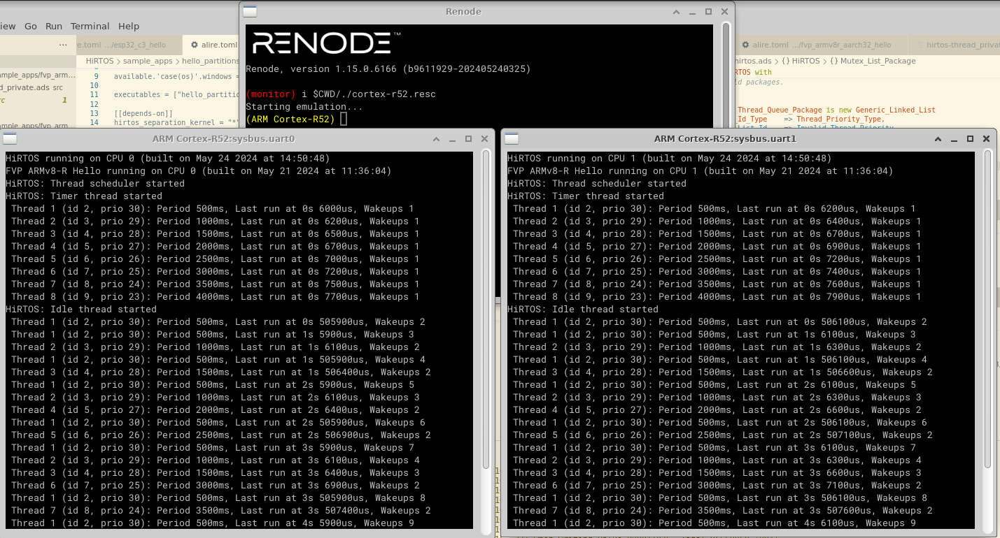
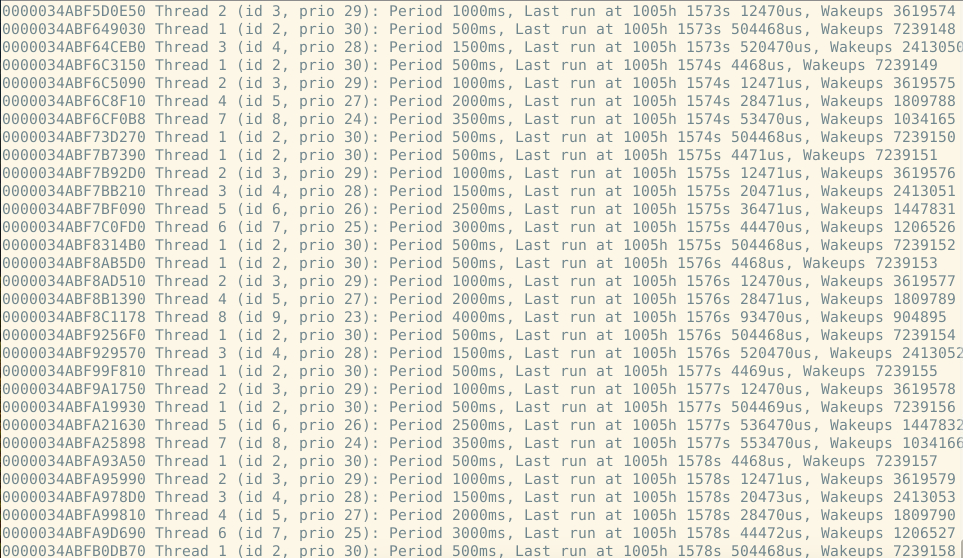

# HiRTOS

This repository hosts HiRTOS, a high-integrity RTOS written in SPARK Ada.

## Motivation

An RTOS is a safety critical component of any bare-metal embedded software system.
Yet, most RTOSes are written in C which is an unsafe language. It would be safer
to use an RTOS written in a safer language, such as Ada or even better SPARK Ada.
However, integrating Ada code components in bare-metal embedded firmware written
in other languages, typically C, is not easy in a portable manner, as the available
baremetal GNAT cross-compilers require the availability of an Ada Runtime for the
target micrcontroller or embedded platform, and such baremetal Ada runtimes are
available only for a very limited number of platforms. HiRTOS solves this problem
by being implemented on top of a minimal platform-independent Ada runtime.
Also, HiRTOS code itself has been written on top of a porting layer that provides
a platform-agnostic interface to HiRTOS. Currently, two porting layers are provided.
One for the ARM Cortex-R52 multi-core processor, and the other for the RISCV-based
ESP32-C3 microcontroller. To port HiRTOS to a new target platform, the
platform-specific components of the porting layer would need to be implemented for
the new target platform.

## HiRTOS Z Specification

HiRTOS is formally specified using the Z notation. The Z specification can
be found [here](doc/HiRTOS.pdf).

## HiRTOS Thread Scheduler TLA+/Pluscal Specification

The HiRTOS thread scheduler is formally specified in TLA+/Pluscal. The TLA+/Pluscal
specification can be found [here](doc/tla_model/HiRTOS.pdf). It was model-checked using the
TLC model checker. The sucessful [TLC run](doc/tla_model/HiRTOS_tla_tlc_run.log) took more than 7 hours:


## Building and Running the HiRTOS Multi-core Sample Applications for ARMv8-R

### Prerequisites

* Install the [`alr`](https://alire.ada.dev/docs/) Ada package manager and meta-build tool
* Install the [ARM Fixed Virtual Platform (FVP) Simulator](https://developer.arm.com/downloads/-/arm-ecosystem-models)
  for ARMv8-R (scroll down to Armv8-R AEM FVP)
* Or, install the [Renode simulator](https://github.com/renode/renode/blob/master/README.rst#installation)

### "Hello World" HiRTOS Sample Application

This HIRTOS sample application launches a set of application threads on each core of a Cortex-R52 processor.

To build it, do:

```
cd sample_apps/fvp_armv8r_aarch32_hello
alr build
```

To run it on the ARM FVP simulator with 4 Cortex-R52 cores and 4 UARTs (one UART per core), do:

```
#
# NOTE:
# - `cluster0.gicv3.SRE-EL2-enable-RAO=1` and `cluster0.gicv3.cpuintf-mmap-access-level=2`
#   are needed to enable access to the GIC CPU interface's system registers
# - `bp.refcounter.non_arch_start_at_default=1` enables the system counter that drives
#   the generic timer counter.
#
<ARM FVP install dir>/models/Linux64_GCC-9.3/FVP_BaseR_AEMv8R \
   -C bp.pl011_uart0.uart_enable=1 \
   -C bp.pl011_uart0.baud_rate=460800 \
   -C cluster0.gicv3.SRE-EL2-enable-RAO=1 \
   -C cluster0.gicv3.cpuintf-mmap-access-level=2 \
   -C bp.refcounter.non_arch_start_at_default=1 \
	--application  bin/fvp_armv8r_aarch32_hello
```

Once the ARM FVP simulator starts, an xterm for the UART output from each CPU core would be
displayed.
An ARM FVP run for the "Hello World" HiRTOS sample application looks like this: 

To run it on Renode with 2 Cortex-R52 cores and 2 UARTs (one UART per core), do:

* Make a copy of `<renode install dir>/renode/scripts/single-node/cortex-r52.resc`, and modify it as follows:

```
$bin?=@bin/fvp_armv8r_aarch32_hello.elf                              # <---- change 1: HiRTOS execuable for ARMv8-R
$name?="ARM Cortex-R52"

using sysbus
mach create $name

machine LoadPlatformDescription @platforms/cpus/cortex-r52_smp.repl  # <---- change 2: Renode multi-core Cortex-R52

showAnalyzer uart0
showAnalyzer uart1                                                   # <---- change 3: CPU 1 output goes to UART1

macro reset
"""
    sysbus LoadELF $bin
"""
runMacro $reset
start                                                                # <---- change 4: To boot the Cortex-R52 automatically
```

* Run Renode:
```
$ renode ./cortex-r52.resc
```
A Renode run for the "Hello World" HiRTOS sample application looks like this: 

### "Hello World" HiRTOS Separation Kernel Sample Application

This sample application demonstrates the HiRTOS separation kernel. It launches two partitions
(guest OSes) on each core of a Cortex-R52 processor. Each partition runs a HiRTOS guest, which
runs a set of application threads.

To build it, do:
```
cd sample_apps/hello_partitions
alr build
```

To run it on the ARM FVP simulator with 4 cores and 4 UARTs (one UART per core), do:
```
<ARM FVP install dir>/models/Linux64_GCC-9.3/FVP_BaseR_AEMv8R \
   -C bp.pl011_uart0.uart_enable=1 \
   -C bp.pl011_uart0.baud_rate=460800 \
   -C cluster0.gicv3.SRE-EL2-enable-RAO=1 \
   -C cluster0.gicv3.cpuintf-mmap-access-level=2 \
   -C bp.refcounter.non_arch_start_at_default=1 \
	--application  bin/hello_partitions.elf
```

An ARM FVP run for the "Hello World" HiRTOS separation kernel sample application looks like this: 

To run it on Renode with 2 Cortex-R52 cores and 2 UARTs (one UART per core), do:

* Make a copy of `<renode install dir>/renode/scripts/single-node/cortex-r52.resc`, and modify it as
described for previous Renode example.
* Run Renode:
```
$ renode ./cortex-r52.resc
```
A Renode run for the "Hello partitions" HiRTOS separation kernel sample application looks like this: 

## Building and Running the HiRTOS Sample Applications for RISC-V

HiRTOS has been ported to the [ESP32-C3](https://www.espressif.com/en/products/socs/esp32-c3) RISC-V-based
microcontroller.

### Prerequisites

* Install the [`alr`](https://alire.ada.dev/docs/) Ada package manager and meta-build tool
* Install the [esptool](https://docs.espressif.com/projects/esptool/en/latest/esp32/) flashing tool
  by doing `pip3 install esptool`.

### "Hello World" HiRTOS Sample Application

This sample application the HiRTOS real-time kernel. It launches a set of application threads.

To build it, do:

```
cd sample_apps/esp32_c3_hello
alr build
```

To run it on an ESP32-C3 board, copy it to the board's flash by doing:

```
esptool.py --chip esp32c3 -p <tty device (e.g., /dev/ttyUSB0)> -b 460800 \
      --before=default_reset --after=hard_reset write_flash \
      --flash_mode dio --flash_freq 80m --flash_size 2MB 0x00000 \
      bin/esp32_c3_hello.bin
```

UART output for runnnig the "Hello World" HiRTOS sample application on the ESP32-C3 board looks like this after 1000
hours of continuous execution: 

&copy; 2023-2024 J. German Rivera

[](https://alire.ada.dev/crates/hirtos.html)
[](https://alire.ada.dev/crates/hirtos_separation_kernel.html)
